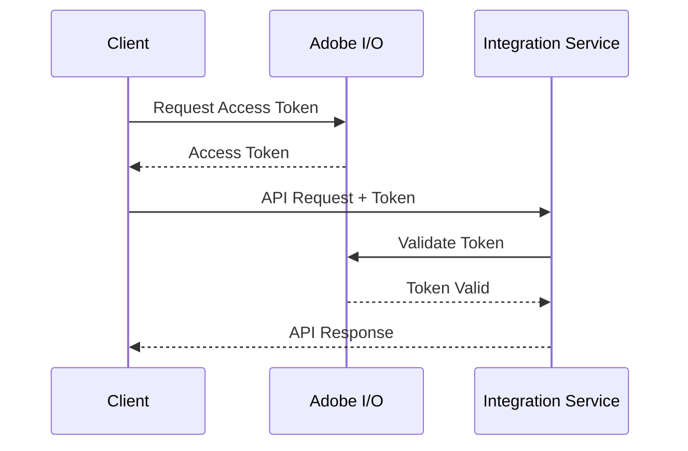

# Authentication Overview

## Introduction

The Adobe Commerce Integration Service uses OAuth 2.0 for authentication through Adobe I/O. This document covers the authentication process, token management, and security best practices.

## Authentication Flow



## Setup Process

1. Create an Adobe I/O Project
   - Log in to [Adobe I/O Console](https://console.adobe.io)
   - Create a new project
   - Add Commerce API to the project

2. Configure Commerce API Integration
   - Select your Commerce instance
   - Configure OAuth scopes
   - Generate credentials

3. Generate Access Tokens
   - Use OAuth flow to obtain tokens
   - Store tokens securely
   - Implement refresh flow

## Token Types

### Access Token

- Used for API authentication
- 24-hour expiration
- Must be included in all requests

### Refresh Token

- Used to obtain new access tokens
- 14-day expiration
- Store securely

## Request Format

Include the access token in the Authorization header:

```http
Authorization: Bearer <access_token>
X-Api-Key: <client_id>
```

## Error Handling

### Invalid Token

```json
{
  "success": false,
  "error": {
    "code": "INVALID_TOKEN",
    "message": "The access token provided is invalid"
  }
}
```

### Expired Token

```json
{
  "success": false,
  "error": {
    "code": "TOKEN_EXPIRED",
    "message": "The access token has expired"
  }
}
```

## Security Best Practices

1. Token Storage
   - Never expose tokens in client-side code
   - Use secure storage solutions
   - Encrypt tokens at rest

2. Token Management
   - Implement token rotation
   - Monitor token usage
   - Revoke compromised tokens

3. Access Control
   - Use minimum required scopes
   - Regularly audit access
   - Follow least privilege principle

For detailed token management information, see [Token Management](token-management.md).
