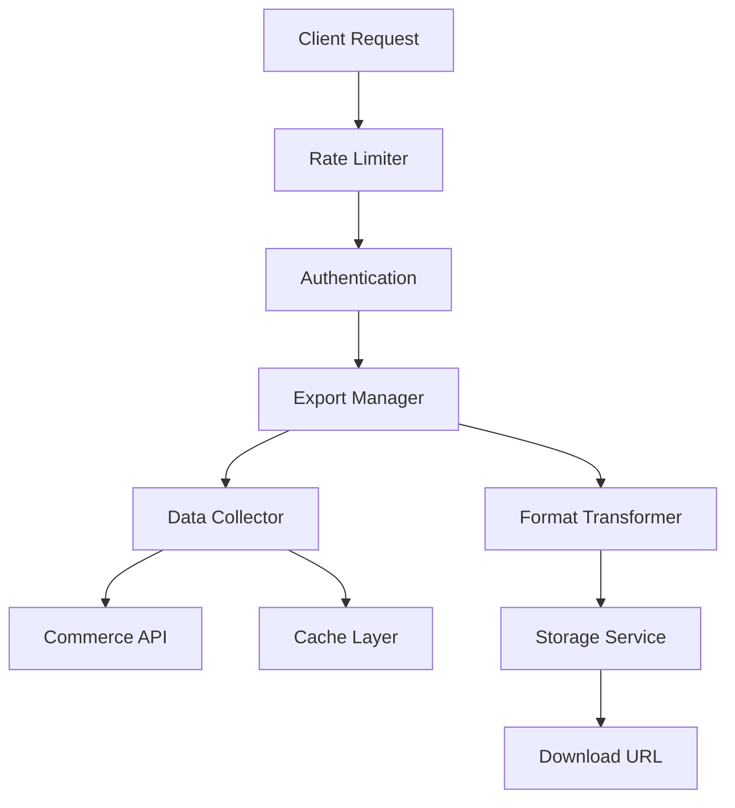

# Product Export Feature Overview

## Introduction

The Product Export feature enables efficient extraction and transformation of product data from Adobe Commerce. This feature supports various export formats, filtering capabilities, and optimization techniques for handling large datasets.

## Key Capabilities

### Export Formats

- CSV (default)
- JSON
- XML
- Custom formats via plugins

### Data Selection

- Field-level selection
- Custom attribute support
- Localized content
- Media gallery export

### Filtering Options

- By category
- By status
- By type
- By custom attributes
- Price range
- Stock status

## Architecture



## Performance Features

1. **Caching**
   - Response caching
   - Incremental updates
   - Cache invalidation strategies

2. **Optimization**
   - Batch processing
   - Parallel execution
   - Memory management
   - Stream processing

3. **Rate Limiting**
   - Per-client limits
   - Burst handling
   - Queue management

## Implementation

### Basic Export

```javascript
const response = await client.products.export({
  format: 'csv',
  fields: ['sku', 'name', 'price'],
  storeId: '1'
});
```

### Filtered Export

```javascript
const response = await client.products.export({
  format: 'json',
  fields: ['sku', 'name', 'price'],
  filters: {
    status: 'enabled',
    type: 'simple',
    price: { gte: 100 }
  },
  storeId: '1'
});
```

## Best Practices

1. **Field Selection**
   - Request only needed fields
   - Use field groups for related data
   - Consider response size

2. **Filtering**
   - Use specific filters
   - Combine filters effectively
   - Test filter combinations

3. **Performance**
   - Implement caching
   - Use pagination
   - Handle rate limits
   - Monitor memory usage

## Error Handling

Common error scenarios and solutions:

1. **Rate Limit Exceeded**
   - Implement backoff strategy
   - Queue requests
   - Monitor limits

2. **Large Datasets**
   - Use pagination
   - Stream responses
   - Implement checkpoints

3. **Invalid Filters**
   - Validate input
   - Handle edge cases
   - Provide clear errors

## Monitoring

Key metrics to track:

- Export duration
- Data volume
- Error rates
- Cache hit rates
- API response times

## Related Documentation

- [API Reference](../../api/endpoints/product-export.md)
- [Performance Optimization](performance-optimization.md)
- [Caching Strategy](caching-strategy.md)
- [Frontend Implementation](frontend-implementation.md)
