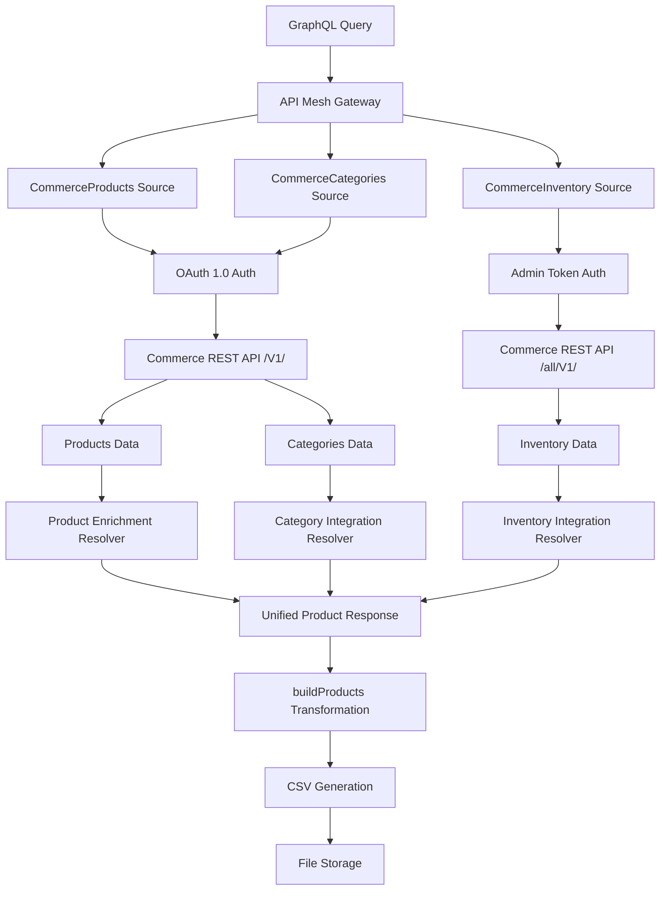

# JSON Schema Multi-Source Architecture

## Overview

This document outlines the JSON Schema multi-source approach for Adobe API Mesh, designed to replace the current monolithic custom resolver with a transparent, maintainable, and truly multi-source architecture.

## Problem Statement

### Current Issues

1. **Configuration Opacity**: Single source configuration hides actual multi-source operations
2. **Monolithic Resolver**: 700+ line resolver handling all data sources and transformations
3. **Limited Schema Access**: OpenAPI handler constrained to 58 exposed endpoints vs. full Commerce API
4. **Authentication Complexity**: Mixed authentication patterns within single resolver
5. **Maintenance Burden**: All logic concentrated in one large resolver file

### Original Goals

- Implement true multi-source mesh capabilities
- Achieve configuration transparency that shows actual data flow
- Avoid monolithic resolver patterns
- Maintain 119 product processing capability
- Preserve OAuth 1.0 authentication implementation
- Enable easier maintenance and code organization

## Solution Architecture

### JSON Schema Handler Advantages

#### 1. Schema Independence

- **No OpenAPI Dependency**: Define operations based on actual API needs, not schema limitations
- **Custom Operations**: Access any Commerce endpoint (not limited to 58 OpenAPI endpoints)
- **Sample-Based Types**: Generate GraphQL types from JSON samples or manual definitions

#### 2. True Multi-Source Configuration

```yaml
meshConfig:
  sources:
    - name: CommerceProducts
      handler:
        jsonSchema:
          endpoint: https://citisignal-com774.adobedemo.com/rest/V1/
          operations:
            - type: Query
              field: products
              path: /products
              method: GET
    
    - name: CommerceCategories
      handler:
        jsonSchema:
          endpoint: https://citisignal-com774.adobedemo.com/rest/V1/
          operations:
            - type: Query
              field: category
              path: /categories/{args.id}
              method: GET
    
    - name: CommerceInventory
      handler:
        jsonSchema:
          endpoint: https://citisignal-com774.adobedemo.com/rest/all/V1/
          operations:
            - type: Query
              field: inventory
              path: /inventory/source-items
              method: GET
```

#### 3. Separated Authentication Patterns

```yaml
# Products & Categories: OAuth 1.0
operationHeaders:
  Authorization: "OAuth {context.headers.oauth-signature}"
  
# Inventory: Admin Token  
operationHeaders:
  Authorization: "Bearer {env.ADMIN_TOKEN}"
```

#### 4. Granular Control Per Source

- **Individual transforms** per source (rename, prefix, filter)
- **Source-specific caching** strategies
- **Independent rate limiting** and retry logic
- **Isolated error handling**

## Architecture Components

### 1. Source Separation Strategy

**CommerceProducts Source**

- **Purpose**: Main product catalog data
- **Authentication**: OAuth 1.0
- **Endpoints**: `/rest/V1/products`, `/rest/V1/products/{sku}`
- **Operations**: Query-based product retrieval

**CommerceCategories Source**

- **Purpose**: Category data and relationships
- **Authentication**: OAuth 1.0  
- **Endpoints**: `/rest/V1/categories/{id}`
- **Operations**: Category lookup and hierarchy

**CommerceInventory Source**

- **Purpose**: Stock levels and inventory data
- **Authentication**: Admin Token
- **Endpoints**: `/rest/all/V1/inventory/source-items`
- **Operations**: Inventory status queries

### 2. Resolver Architecture

Instead of monolithic resolver, use **source-specific resolvers**:

```javascript
// resolvers/product-enrichment.js
module.exports = {
  Query: {
    enrichedProducts: async (parent, args, context) => {
      // Call Products source
      const products = await context.CommerceProducts.Query.products();
      // Minimal enrichment logic specific to products
      return products;
    }
  }
};

// resolvers/category-integration.js  
module.exports = {
  Product: {
    categories: async (product, args, context) => {
      // Call Categories source with product category IDs
      const categories = await Promise.all(
        product.category_ids.map(id => 
          context.CommerceCategories.Query.category({ id })
        )
      );
      return categories;
    }
  }
};

// resolvers/inventory-integration.js
module.exports = {
  Product: {
    inventory: async (product, args, context) => {
      // Call Inventory source
      const inventory = await context.CommerceInventory.Query.inventory({
        sku: product.sku
      });
      return inventory;
    }
  }
};
```

### 3. Native Mesh Features Integration

**Type Merging Configuration**

```yaml
additionalTypeDefs: |
  extend type Product {
    categories: [Category]
    inventory: InventoryItem
  }

transforms:
  - typeMerging:
      Product:
        key: sku
        resolve: (root, context, info) => root.sku
```

**Source-Specific Transforms**

```yaml
sources:
  - name: CommerceProducts
    transforms:
      - rename:
          renames:
            - from: { field: "media_gallery_entries" }
              to: { field: "images" }
      - filter:
          schema: |
            type Query {
              products: [Product]
            }
```

## Implementation Benefits

### 1. Configuration Transparency

- **Visible Data Flow**: Each source clearly shows its role and endpoints
- **Authentication Clarity**: Per-source auth patterns visible in configuration
- **Endpoint Mapping**: Direct relationship between source and actual API calls

### 2. Maintainability Improvements

- **Separated Concerns**: Each resolver handles one specific integration
- **Independent Testing**: Test sources and resolvers in isolation
- **Gradual Migration**: Convert one source at a time
- **Easier Debugging**: Trace issues to specific sources

### 3. Performance Optimizations

- **Source-Level Caching**: Cache strategies tailored to data update patterns
- **Parallel Processing**: Native mesh optimization between sources
- **Selective Fetching**: Only call sources needed for specific queries
- **Batching Support**: Per-source batching optimization

### 4. Native Mesh Integration

- **Built-in Features**: Leverage mesh transforms, caching, rate limiting
- **Schema Stitching**: Automatic type merging and relationship handling
- **Error Boundaries**: Isolated error handling per source
- **Monitoring**: Source-specific metrics and logging

## Data Flow Architecture



## Comparison: Current vs. Proposed

| Aspect | Current Monolithic | Proposed Multi-Source |
|--------|-------------------|----------------------|
| **Configuration** | Single source hiding complexity | Three sources showing actual data flow |
| **Resolver Size** | 700+ line monolithic resolver | 3 focused resolvers (50-100 lines each) |
| **Authentication** | Mixed auth in single resolver | Clear auth per source |
| **Debugging** | Trace through single large file | Isolate to specific source/resolver |
| **Testing** | Test entire integration | Test sources independently |
| **Caching** | Single cache strategy | Source-specific caching |
| **Error Handling** | Single point of failure | Isolated error boundaries |
| **Maintenance** | Modify large resolver | Update specific resolver |
| **Performance** | Manual optimization | Native mesh optimizations |

## Migration Strategy

### Phase 1: Foundation (Week 1)

- Create JSON schema source configurations
- Implement sample-based type definitions
- Set up basic authentication per source

### Phase 2: Resolver Separation (Week 2)  

- Break monolithic resolver into source-specific resolvers
- Implement type merging for data relationships
- Add source-specific transforms

### Phase 3: Optimization (Week 3)

- Configure source-level caching strategies
- Implement performance monitoring
- Add error boundaries and retry logic

### Phase 4: Testing & Validation (Week 4)

- Validate 119 product processing capability
- Performance testing and optimization
- Documentation and knowledge transfer

## Success Metrics

### Functional Requirements

- ✅ **119 Product Processing**: Maintain current product volume capability
- ✅ **CSV Export**: Generate identical CSV output format  
- ✅ **OAuth Authentication**: Preserve OAuth 1.0 implementation
- ✅ **Performance Parity**: Match or exceed current performance

### Architecture Goals

- ✅ **Configuration Transparency**: Clear source-to-endpoint mapping
- ✅ **Resolver Maintainability**: Sub-100 line focused resolvers
- ✅ **Independent Testing**: Source isolation for unit testing
- ✅ **Native Feature Usage**: Leverage mesh transforms and optimizations

### Technical Benefits

- ✅ **Error Isolation**: Source-specific error boundaries
- ✅ **Performance Optimization**: Source-level caching and batching
- ✅ **Development Velocity**: Faster iteration on specific sources
- ✅ **Code Quality**: Improved maintainability and readability

## Conclusion

The JSON Schema multi-source approach directly addresses the original goals of configuration transparency and resolver maintainability while preserving all current functionality. This architecture provides a clear upgrade path that leverages native mesh features for better performance, maintainability, and development experience.
