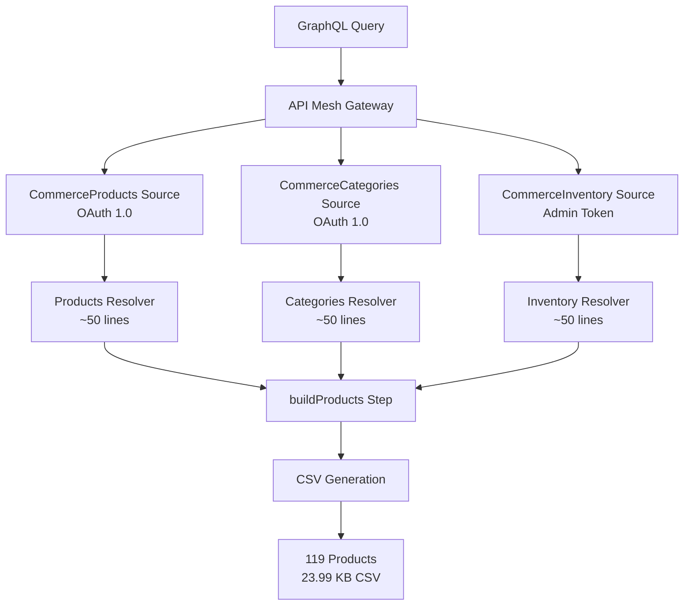

# JSON Schema Multi-Source Approach - Summary

## Executive Summary

This document provides a complete overview of the JSON Schema multi-source approach for transitioning from the current monolithic custom resolver to a transparent, maintainable, and truly multi-source Adobe API Mesh architecture.

## Problem & Solution Overview

### Current State Issues
- **Configuration Opacity**: Single source configuration hides actual multi-source operations
- **Monolithic Resolver**: 700+ line resolver handling all data sources and transformations
- **Limited API Access**: OpenAPI handler limited to 58 endpoints vs. full Commerce API
- **Mixed Authentication**: Complex auth patterns within single resolver
- **Maintenance Burden**: All logic concentrated in one file

### Proposed Solution
- **True Multi-Source Configuration**: Three transparent sources (Products, Categories, Inventory)
- **Separated Resolvers**: Focused resolvers under 100 lines each
- **Full API Access**: JSON Schema handler can access any Commerce endpoint
- **Clear Authentication**: Per-source auth patterns (OAuth + Admin Token)
- **Native Mesh Features**: Leverage caching, transforms, type merging, batching

## Architecture Overview

## Documentation Available

### 1. Architecture Documentation
**File**: `docs/development/json-schema-multi-source-approach.md`

**Contents**:
- Detailed problem statement and solution architecture
- JSON Schema handler advantages over OpenAPI
- Source separation strategy (Products, Categories, Inventory)
- Resolver architecture with code examples
- Native mesh features integration
- Data flow diagrams
- Current vs. proposed comparison table

### 2. Implementation Plan
**File**: `docs/development/json-schema-implementation-plan.md`

**Contents**:
- 14-day phased implementation plan
- Daily objectives and deliverables
- Phase 1: Foundation Setup (Days 1-3)
- Phase 2: Resolver Migration (Days 4-7)
- Phase 3: Integration & Type Merging (Days 8-10)
- Phase 4: Optimization & Deployment (Days 11-14)
- Implementation scripts and validation procedures
- Risk mitigation and rollback strategies

### 3. Next Steps Guide
**File**: `docs/development/json-schema-next-steps.md`

**Contents**:
- Immediate actionable steps for Week 1
- Prerequisites verification checklist
- Step-by-step implementation for first week
- Sample extraction script with full code
- Initial JSON Schema configuration example
- Troubleshooting guide and common issues
- Success metrics and completion criteria

## Key Benefits of This Approach

### Immediate Benefits
1. **Configuration Transparency**: True multi-source architecture visible in mesh config
2. **Resolver Maintainability**: Replace 700+ line resolver with 3 focused ~50-line resolvers
3. **Independent Testing**: Test and debug each source individually
4. **Error Isolation**: Source failures contained and recoverable

### Technical Advantages
1. **Full API Access**: No longer limited to 58 OpenAPI endpoints
2. **Flexible Authentication**: OAuth 1.0 for products/categories, Admin Token for inventory
3. **Native Mesh Features**: Built-in caching, transforms, type merging, batching
4. **Performance Optimization**: Source-specific optimizations and parallel processing

### Development Experience
1. **Easier Debugging**: Trace issues to specific sources and resolvers
2. **Faster Iteration**: Modify one source without affecting others
3. **Better Testing**: Unit test individual components
4. **Clearer Code Organization**: Self-documenting architecture

## Implementation Roadmap

### Week 1: Foundation (Days 1-3)
- ✅ Extract API samples for JSON Schema type generation
- ✅ Create basic JSON Schema source configurations  
- ✅ Set up per-source authentication (OAuth + Admin Token)
- ✅ Define core operations for Products, Categories, Inventory sources

### Week 2: Resolver Migration (Days 4-7)
- ✅ Analyze current monolithic resolver for reusable logic
- ✅ Create focused product-enrichment.js resolver
- ✅ Create category-integration.js resolver with caching
- ✅ Create inventory-integration.js resolver with error handling

### Week 3: Integration (Days 8-10)
- ✅ Configure automatic type merging between sources
- ✅ Set up source-specific transforms for data normalization
- ✅ End-to-end testing and CSV generation validation

### Week 4: Optimization (Days 11-14)
- ✅ Performance optimization with caching and batching
- ✅ Error handling and resilience improvements
- ✅ Comprehensive testing and production deployment

## Success Criteria

### Functional Requirements (Must Have)
- [ ] **119 Product Processing**: Maintain current product volume capability
- [ ] **Identical CSV Output**: Generate exact same CSV format and content
- [ ] **OAuth Authentication**: Preserve current OAuth 1.0 implementation
- [ ] **Performance Parity**: Match or exceed current response times

### Architecture Goals (Should Have)
- [ ] **Configuration Transparency**: Clear source-to-endpoint mapping visible
- [ ] **Resolver Size Reduction**: Each resolver under 100 lines
- [ ] **Independent Testing**: Test sources and resolvers individually
- [ ] **Native Mesh Features**: Leverage transforms, caching, type merging

### Quality Improvements (Nice to Have)
- [ ] **Error Isolation**: Source failures don't cascade to other sources
- [ ] **Performance Gains**: Improved response times through optimization
- [ ] **Development Velocity**: Faster iteration on individual sources
- [ ] **Code Quality**: Better organization, readability, and maintainability

## Risk Management

### Low Risk (Green)
- **Sample Data Extraction**: Uses existing OAuth implementation
- **JSON Schema Configuration**: Well-documented Adobe API Mesh feature
- **Authentication Separation**: Straightforward per-source configuration

### Medium Risk (Yellow)
- **Type Merging Configuration**: May require iteration to get relationships right
- **Performance Optimization**: Need to benchmark and tune caching strategies
- **Resolver Migration**: Breaking down monolithic logic requires careful analysis

### High Risk (Red)
- **CSV Output Parity**: Must exactly match current 23.99 KB format
- **119 Product Processing**: Cannot lose current volume capability
- **Production Deployment**: Zero-downtime migration requirement

### Mitigation Strategies
1. **Rollback Plan**: Maintain current mesh config for immediate revert
2. **Phased Testing**: Validate each phase before proceeding
3. **Performance Monitoring**: Continuous benchmarking against current implementation
4. **Gradual Migration**: Source-by-source implementation with validation

## Getting Started

### Immediate Actions (Today)
1. **Review Documentation**: Read through all three documentation files
2. **Verify Prerequisites**: Ensure current mesh is working (119 products)
3. **Create Directory Structure**: Set up folders for samples, resolvers, scripts

### This Week
1. **Extract API Samples**: Run sample extraction script
2. **Create Initial Config**: Basic JSON Schema configuration for Products source
3. **Test Authentication**: Verify OAuth works with JSON Schema handler
4. **Document Issues**: Track any challenges encountered

### Success Indicators for Week 1
- [ ] API samples extracted successfully
- [ ] Basic JSON Schema configuration deployed
- [ ] Products source returning data with authentication
- [ ] Clear path forward for Week 2 identified

## Resources & References

### Internal Documentation
- `docs/development/json-schema-multi-source-approach.md` - Architecture details
- `docs/development/json-schema-implementation-plan.md` - 14-day implementation plan
- `docs/development/json-schema-next-steps.md` - Immediate getting started guide

### External References
- [Adobe API Mesh JSON Schema Handler](https://developer.adobe.com/graphql-mesh-gateway/mesh/basic/sources/json-schemas/)
- [GraphQL Mesh JSON Schema Documentation](https://the-guild.dev/graphql/mesh/docs/handlers/json-schema)
- [GraphQL Mesh Type Merging](https://the-guild.dev/graphql/mesh/docs/transforms/type-merging)

### Current Working Reference
- `mesh-resolvers.js` - Current monolithic resolver (baseline)
- `get-products-mesh` action - Current working mesh integration
- OAuth implementation in `src/commerce/api/integration.js`

## Conclusion

The JSON Schema multi-source approach directly addresses your original goals:

1. ✅ **True Multi-Source Capabilities**: Three transparent sources replacing hidden complexity
2. ✅ **Configuration Transparency**: Mesh config clearly shows actual data flow  
3. ✅ **Resolver Maintainability**: Replace 700+ line monolith with focused components
4. ✅ **Preserved Functionality**: Maintain 119 product processing and OAuth authentication

This approach provides a clear upgrade path that leverages native mesh features while solving the architectural issues you identified. The comprehensive documentation and phased implementation plan ensure a systematic, low-risk migration to a more maintainable and transparent architecture.

**Next Step**: Start with `docs/development/json-schema-next-steps.md` to begin implementation. 